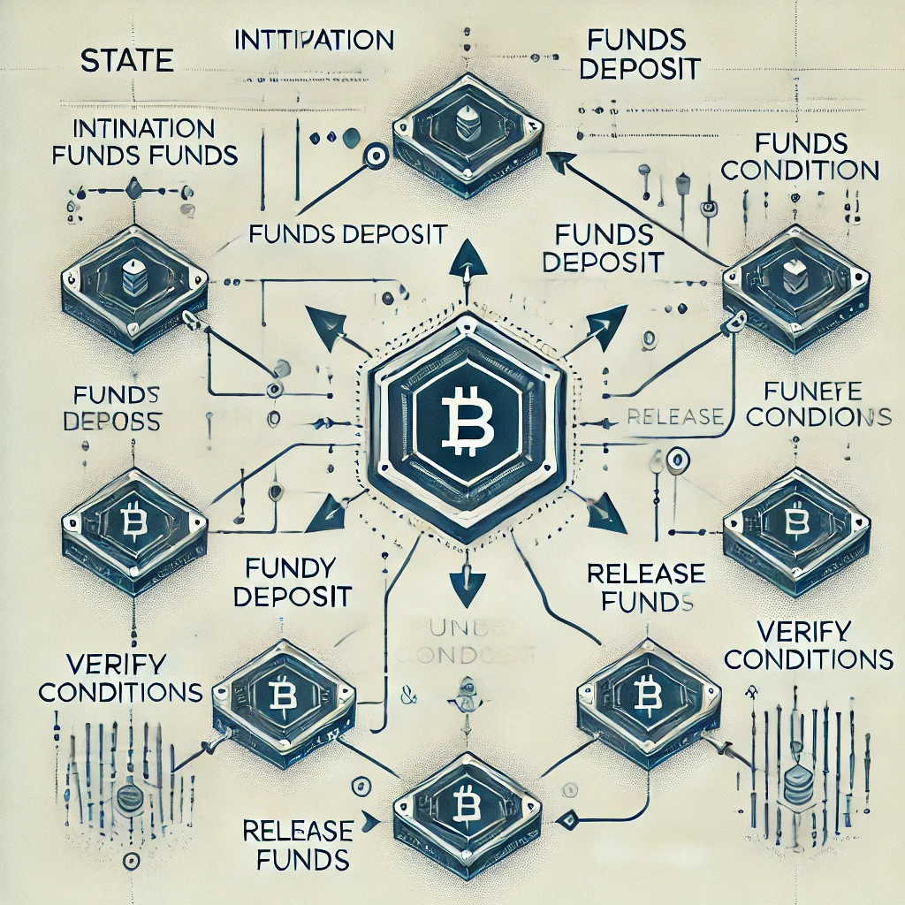
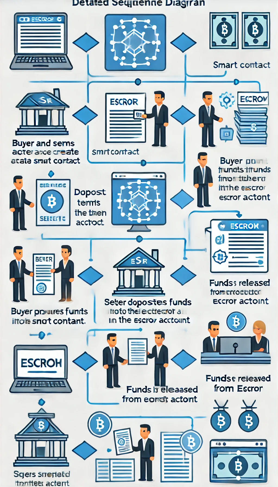
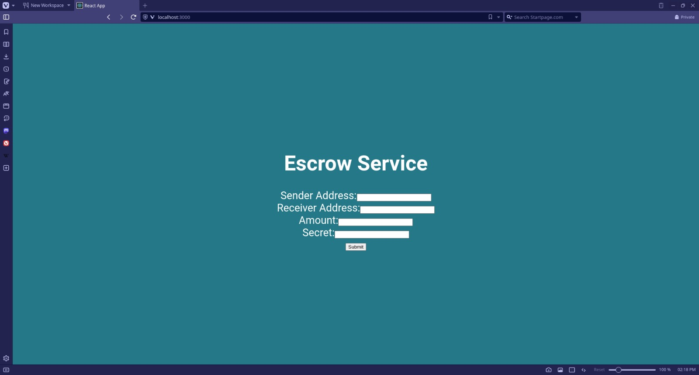

# Hyperledger Fabric-based Escrow System for Real Estate Transactions

## Executive Summary
This report explores the development of a secure and efficient escrow system for real estate transactions leveraging Hyperledger Fabric, a permissioned blockchain framework. Real estate transactions can be complex and time-consuming, often involving multiple parties and paperwork. Traditional escrow services, while secure, can be slow and prone to errors due to manual processes. This project proposes a Hyperledger Fabric-based escrow system that streamlines the process, enhances transparency, and minimizes the risk of fraud.

## 1. Introduction
Innovation is welcome in the real estate sector, especially when it comes to expediting transaction procedures. Blockchain technology has a lot to offer escrow, which is an essential component of safe money management in real estate transactions. In order to overcome the drawbacks of conventional escrow procedures and improve the whole real estate transaction experience, this paper suggests an escrow system built on the Hyperledger Fabric.

### 1.1. Problem Statement
A lot of procedures, documentation, and communication between buyers, sellers, lenders, escrow agents, and real estate brokers are frequently involved in real estate transactions. Although safe, traditional escrow services can be sluggish and prone to mistakes because they rely on human procedures. Paper-based documentation also poses problems with accessibility and data integrity.

### 1.2. Proposed Solution: Hyperledger Fabric Escrow System
This project proposes a Hyperledger Fabric-based escrow system that streamlines the escrow process while maintaining the high level of security expected. Hyperledger Fabric is a permissioned blockchain framework offering a secure and auditable platform for recording transactions.

## 2. Hyperledger Fabric for Real Estate Escrow
Hyperledger Fabric is a blockchain framework well-suited for real estate escrow applications due to its unique features:

- **Security:** Transactions are cryptographically secured on the blockchain, making them tamper-proof and auditable.
- **Permissioned Network:** Only authorized participants can access the network, ensuring privacy and control.
- **Smart Contracts:** Predefined business logic (chaincode) automates critical steps in the escrow process.
- **Scalability:** The network can be scaled to accommodate a growing number of users and transactions.

### 2.1. Benefits of Hyperledger Fabric Escrow
- **Enhanced Security:** Blockchain technology eliminates the risk of fraud or tampering with escrow funds.
- **Increased Transparency:** All participants have access to a shared ledger of transactions, fostering trust and accountability.
- **Improved Efficiency:** Automating manual tasks streamlines the escrow process and reduces transaction time.
- **Reduced Costs:** Eliminating paper-based documentation and streamlining processes can lower administrative costs.
- **Dispute Resolution:** The immutable transaction record on the blockchain provides a clear audit trail in case of disputes.

## 3. System Architecture and Design
The Hyperledger Fabric escrow system will be designed with the following core components:

- **Network Participants:** Buyers, sellers, escrow agent, regulators (optional).
- **Channels:** Secure, private communication channels within the network for specific transactions.
- **Chaincode:** Smart contracts deployed on the network that govern the escrow process logic.
- **Ledger:** Distributed ledger shared across all participants, recording all transaction data immutably.

### 3.1. Role-Based Access Control (RBAC)
The system will employ RBAC to ensure authorized access for different participants:

- **Buyers:** Deposit funds into the escrow account, approve the release of funds upon fulfilling conditions.
- **Sellers:** Receive funds upon meeting agreed-upon conditions.
- **Escrow Agent:** Monitors transactions, facilitates communication, and enforces smart contract rules.
- **Regulators (Optional):** May have designated access for auditing purposes (depending on regulatory requirements).

### 3.2. Escrow Process Flow
Here's a breakdown of the typical escrow process flow within the system:

1. **Initiation:** Buyer and seller initiate the escrow process by entering into a smart contract agreement on the network.
2. **Deposit:** Buyer deposits funds into the secure escrow account on the blockchain.
3. **Fulfillment:** Seller fulfills agreed-upon conditions (e.g., property handover).
4. **Verification:** Escrow agent verifies the fulfillment of conditions.
5. **Release:** Upon verification, the smart contract automatically releases funds from escrow to the seller.

## 4. Technical Implementation
The technical implementation will involve the following steps:

- **Network Setup:** Establish the Hyperledger Fabric network with consortium members (participants).
- **Chaincode Development:** Develop smart contracts defining the escrow process logic and rules.
- **Front-End Development:** Develop a user-friendly interface for buyers, sellers, and the escrow agent to interact with the blockchain network.
- **Integration:** Integrate the front-end application with the Hyperledger Fabric backend to facilitate secure communication and transaction execution.
- **Testing and Deployment:** Conduct thorough testing of the system to ensure functionality and security before deploying to production.

## Team
- Kolade
- Omar
- Nithin
- Nodeirbek

## Requirements
- Docker
- Hyperledger Fabric
- Node.js

## State Diagram

## Sequence Diagram

## Roles and Policies
- **Buyers:** Authorized to deposit and approve the release of funds.
- **Sellers:** Authorized to receive funds upon condition fulfillment.
- **Escrow Agent:** Authorized to monitor and verify transactions.
- **Regulators:** Optional access for auditing purposes.

## Snapshots of Application 
Frontend working but due to chaincode could not fully integrate 
\
